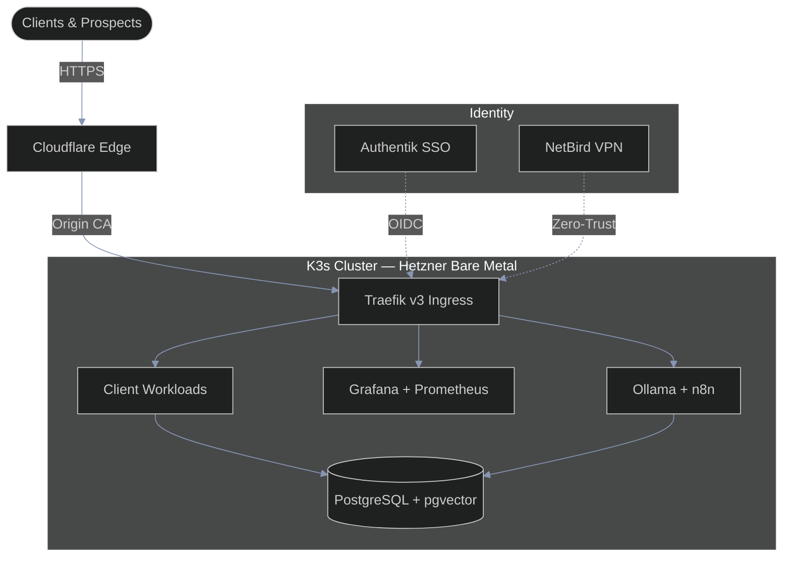
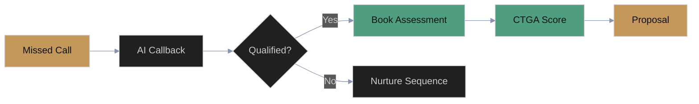
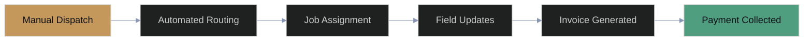
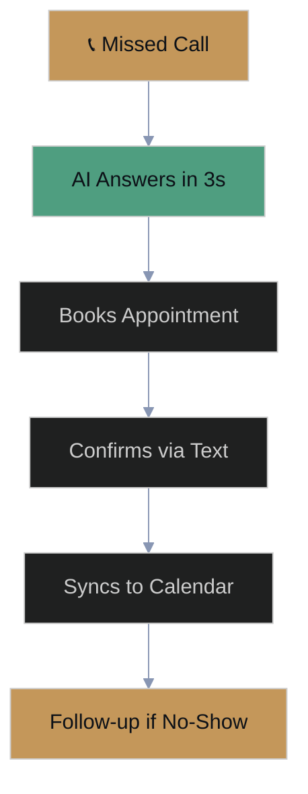

<!-- ╔══════════════════════════════════════════════════════════════╗ -->
<!-- ║  Wakeem Williams — GitHub Profile README                    ║ -->
<!-- ║  Founder, Helix Stax | Systems Architect                    ║ -->
<!-- ║  Brand: #4F9E80 sage-teal · #C4975A amber · #0D1117 bg     ║ -->
<!-- ╚══════════════════════════════════════════════════════════════╝ -->

<div align="center">

<br/>

<br/><br/>
<a href="https://helixstax.com"></a>
<br/><br/>
<a href="https://github.com/KeemWilliams"></a>&nbsp;
<a href="https://github.com/KeemWilliams/keemwilliams"></a>&nbsp;
<a href="https://helixstax.com"></a>
</div>

---

<!-- ═══════════════════ ABOUT ═══════════════════ -->

### About Me

Wakeem Williams is the Founder and CEO of [Helix Stax](https://helixstax.com), a business operations consulting firm based on one observation: companies keep buying software that their teams never actually use.

I spent 15 years as a systems architect and platform engineer. Cloud, DevOps, SRE, ML pipelines. The whole stack. And the thing I kept seeing wasn't a technology problem. It was a people problem wearing a technology mask. A 300-person company I worked with had three overlapping platforms, $3.6M in annual licensing, and 20% adoption across the board. Nobody was using any of it. That's not a vendor issue. That's an organizational failure, and nobody in the building wanted to say it out loud.

So I built a company that says it out loud.

> *"Systems that nobody uses are just overhead. We make sure your people and your systems are actually aligned — so you stop paying for both and only getting half."*

```yaml
Role:       Founder & CEO, Helix Stax
Focus:      Business Operations Consulting
Framework:  CTGA (Controls, Technology, Growth, Adoption)
Stack:      K3s · GitOps · Python · Go · TypeScript
Philosophy: Transparency over abstraction · Ownership over convenience
```

<div align="center">

[](https://linkedin.com/in/wakeemwilliams)
[](https://calendly.com/wakeemwilliams)
[](https://x.com/wakeemwilliams)
[](https://facebook.com/helixstax)
[](https://instagram.com/helixstax)

</div>

---

<!-- ═══════════════════ WHAT I'M BUILDING ═══════════════════ -->

##  What I'm Building

**🏢 Helix Stax** — Business operations consulting. We run CTGA Framework assessments to find the gap between what companies pay for and what their teams actually touch. Then we close that gap. Permanently. [](https://helixstax.com)

**🧬 CTGA Framework** — Our proprietary systems adoption scoring model. Two paired strands: **C**ontrols + **T**echnology measure the systems side, **G**rowth + **A**doption measure the people side. Scores run 100-900. The gap between strands is the diagnosis.

**🎨 Brand Asset Generator** — Automated brand kit pipeline. One upload, 13 platforms, 24+ export formats, EXIF metadata baked in, 8K supersampling. I got tired of manually resizing logos. [](https://github.com/KeemWilliams/brandkit)

**🌐 helixstax.com** — The website. Astro 5, Tailwind v4, Shadcn UI, GSAP animations, self-hosted analytics. Dark-mode-first, performance-obsessed, built to convert. [](https://github.com/KeemWilliams/helixstax.com)

---

<!-- ═══════════════════ CURRENTLY WORKING ON ═══════════════════ -->

<details>
<summary><strong>🔭 Currently Working On</strong></summary>
<br/>

| Project | Status | Description |
|---------|--------|-------------|
| **Helix Stax Platform** | 🟢 Active | CTGA assessments and client delivery for business operations consulting |
| **Brand Asset Generator** | 🟡 Building | Upload a selfie, get an AI headshot, walk away with a full brand kit for 13 platforms |
| **Lead Automation Workflows** | 🟢 Active | n8n pipelines that score prospects, trigger follow-ups, and keep the CRM honest |
| **Automated Phone System** | 🟡 Building | Missed calls get answered in 3 seconds, appointments get booked without a human |
| **Client Onboarding Engine** | 🟢 Active | Intake form to CTGA assessment to finished report — no manual steps in between |
| **Infrastructure Platform** | 🟢 Active | K3s + Devtron on Hetzner bare metal. Self-hosted. No cloud vendor lock-in. |

</details>

---

<!-- ═══════════════════ TECH STACK ═══════════════════ -->

##  Tech Stack

What I build with. No fluff — these are the tools I actually use.

**Infrastructure & Cloud**

        

**DevOps & GitOps**

    

**Languages & Frameworks**

       

**Data & Observability**

    

**AI & Automation**

  

**Security & Identity**

  

---

<!-- ═══════════════════ ARCHITECTURE DIAGRAM ═══════════════════ -->

<details>
<summary><strong>🏗️ Infrastructure Architecture — HelixStax Platform</strong></summary>
<br/>



</details>

---

<!-- ═══════════════════ CERTIFICATIONS ═══════════════════ -->

##  Certifications & Education

<div align="center">

| | Credential | Issuer |
|---|---|---|
|  | **MIT Professional Education** | Massachusetts Institute of Technology |
|  | **Harvard Professional Development** | Harvard University |
|  | **AWS Certified** | Amazon Web Services |
|  | **Google Cloud Certified** | Google Cloud |
|  | **Microsoft Azure Certified** | Microsoft |
|  | **CompTIA Certified** | CompTIA |
|  | **ITIL Foundation** | Axelos |
|  | **Agile / Scrum Certified** | Scrum Alliance |

</div>

---

<!-- ═══════════════════ FEATURED PROJECTS ═══════════════════ -->

##  Featured Projects

<div align="center">

### 🏗️ HelixStax Infrastructure

The whole Helix Stax platform runs on this. K3s on Hetzner bare metal, Devtron for CI/CD, ArgoCD for GitOps, Authentik for identity, NetBird for zero-trust networking. No AWS bill. No Azure dependency. We own the stack.

  

[](https://github.com/KeemWilliams/helix-stax-infra)

---

### 🎨 Brand Asset Kit

One source SVG goes in. 24+ platform-ready assets come out — with EXIF metadata, 8K supersampling, and LANCZOS downscaling. I built this because resizing the same logo for LinkedIn, Instagram, Twitter, and ten other places was eating hours I didn't have.

  

[](https://keemwilliams.github.io/brandkit/platform-assets.html) [](https://github.com/KeemWilliams/brandkit)

---

### 🤖 MCP Server — CI/CD

Open-source Model Context Protocol server that lets AI agents talk to CI/CD pipelines. Written in Go. If you're building agent tooling and need pipeline access, this is the bridge.

  

[](https://github.com/KeemWilliams/mcp-server-cicd)

---

### 📚 Technical Documentation

Public engineering docs. Runbooks, architecture decisions, infrastructure patterns. I build in the open because I've wasted too many hours on undocumented systems to inflict that on anyone else.

 

[](https://docs.wakeemwilliams.com)

</div>

---

<!-- ═══════════════════ AUTOMATION SHOWCASE ═══════════════════ -->

<details>
<summary><strong>⚡ Automation in Action — What We Build for Clients</strong></summary>
<br/>

### Lead Pipeline

Missed calls turn into booked appointments. Or warm nurture contacts. Nothing sits in a voicemail box going stale.



### Client Operations Automation

First dispatch to final payment. No manual handoffs, no forgotten invoices, no "I thought you sent that."



### Missed Call Recovery

Phone rings. Nobody picks up. Three seconds later, the system does.



</details>

---

<!-- ═══════════════════ GITHUB STATS ═══════════════════ -->

##  GitHub Activity

<div align="center">


<br/><br/>

[](https://git.io/streak-stats)

</div>

---

<!-- ═══════════════════ COLLABORATION ═══════════════════ -->

<details>
<summary><strong>🤝 Open to Collaboration</strong></summary>
<br/>

I'm looking for people building in these areas:

- Infrastructure-as-Code patterns and GitOps workflows
- Zero-trust networking and identity management
- Business operations consulting tools (there aren't enough good ones)
- AI agent integrations with CI/CD and DevOps tooling
- Open-source brand tooling — asset generation, design systems, anything that saves a founder from Canva at 2am

If you're working on something adjacent, or if your company is paying for tools that collect dust, [let's talk](https://helixstax.com).

[](https://calendly.com/wakeemwilliams)

</details>

---

<!-- ═══════════════════ FOOTER ═══════════════════ -->

<div align="center">


<br/>

<a href="https://helixstax.com">
  
</a>
<a href="https://keemwilliams.github.io/brandkit/platform-assets.html">
  
</a>
<a href="https://docs.wakeemwilliams.com">
  
</a>

<br/><br/>

<sub>
  <strong>Wakeem Williams</strong> · Founder & CEO, <a href="https://helixstax.com">Helix Stax</a><br/>
  <em>"We promise to never leave you alone with a system your people cannot, or will not, use."</em>
</sub>

<br/><br/>

<picture>
  
</picture>

</div>
