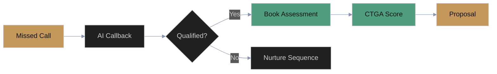
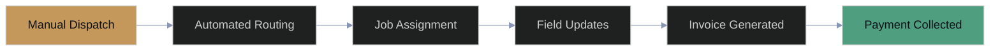
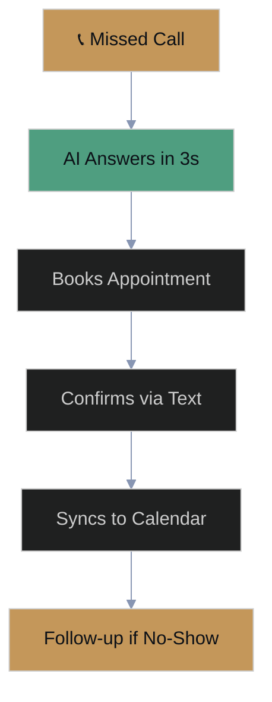

<!-- ╔══════════════════════════════════════════════════════════════╗ -->
<!-- ║  Wakeem Williams — GitHub Profile README                    ║ -->
<!-- ║  Founder, Helix Stax | Systems Architect                    ║ -->
<!-- ║  Brand: #4F9E80 sage-teal · #C4975A amber · #0D1117 bg     ║ -->
<!-- ╚══════════════════════════════════════════════════════════════╝ -->

<div align="center">

<br/>

<br/><br/>
<a href="https://helixstax.com"></a>
<br/><br/>
<a href="https://github.com/KeemWilliams"></a>&nbsp;
<a href="https://github.com/KeemWilliams/keemwilliams"></a>&nbsp;
<a href="https://helixstax.com"></a>
</div>

---

<!-- ═══════════════════ ABOUT ═══════════════════ -->

<table>
<tr>
<td width="55%" valign="top">

### About Me

I'm **Wakeem Williams** — Founder & CEO of **[Helix Stax](https://helixstax.com)**, a business operations consulting firm that closes the gap between the systems companies buy and the workflows their teams actually use.

I build on 15 years of experience as a **Systems Architect** and **Platform Engineer**, bringing infrastructure-grade rigor to business operations. My background spans cloud architecture, DevOps, SRE, and AI/ML pipelines — and I use all of it to solve a deceptively simple problem: **why do companies keep paying for tools nobody uses?**

> *"Systems that nobody uses are just overhead. We make sure your people and your systems are actually aligned — so you stop paying for both and only getting half."*

</td>
<td width="45%" valign="top">

### Quick Facts

```yaml
Role:      Founder & CEO, Helix Stax
Focus:     Business Operations Consulting
Framework: CTGA (Controls, Technology, Growth, Adoption)
Stack:     K3s · GitOps · Python · Go · TypeScript
Philosophy: Transparency over abstraction
            Ownership over convenience
Location:  United States
```

<p align="center">

[](https://linkedin.com/in/wakeemwilliams)
[](https://calendly.com/wakeemwilliams)
[](https://x.com/wakeemwilliams)
[](https://facebook.com/helixstax)
[](https://instagram.com/helixstax)

</p>

</td>
</tr>
</table>

---

<!-- ═══════════════════ WHAT I'M BUILDING ═══════════════════ -->

##  What I'm Building

<table>
<tr>
<td width="33%" align="center">

**🏢 Helix Stax**<br/>
<sub>Business Operations Consulting</sub>

The firm. We use the **CTGA Framework** to audit how companies use their tech stack, find the gaps between tools and teams, and close them — permanently.

[](https://helixstax.com)

</td>
<td width="33%" align="center">

**🧬 CTGA Framework**<br/>
<sub>Controls, Technology, Growth, Adoption</sub>

A proprietary maturity scoring framework. Two paired strands — **C**ontrols + **T**echnology (the systems strand) and **G**rowth + **A**doption (the people strand). Scores 100-900. The mismatch between strands IS the diagnosis.

</td>
<td width="33%" align="center">

**🎨 Brand Asset Generator**<br/>
<sub>Open Source Toolkit</sub>

Automated brand kit pipeline — generates platform-optimized assets (13 platforms, 24+ formats) from source SVGs with EXIF metadata, supersampling, and LANCZOS downscaling.

[](https://github.com/KeemWilliams/brandkit)

</td>
</tr>
</table>

---

<!-- ═══════════════════ CURRENTLY WORKING ON ═══════════════════ -->

<details>
<summary><strong>🔭 Currently Working On</strong></summary>
<br/>

| Project | Status | Description |
|---------|--------|-------------|
| **Helix Stax Platform** | 🟢 Active | Business operations consulting — CTGA assessments, client delivery |
| **Brand Asset Generator** | 🟡 Building | Web app: upload selfie → AI headshot → full brand kit for 13 platforms |
| **Lead Automation Workflows** | 🟢 Active | n8n pipelines for prospect scoring, follow-up sequences, CRM sync |
| **Automated Phone System** | 🟡 Building | AI-powered call handling — missed call recovery, appointment booking |
| **Client Onboarding Engine** | 🟢 Active | Automated intake → CTGA assessment → report generation pipeline |
| **Infrastructure Platform** | 🟢 Active | K3s + Devtron on Hetzner — self-hosted, zero cloud lock-in |

</details>

---

<!-- ═══════════════════ ARCHITECTURE DIAGRAM ═══════════════════ -->

<details>
<summary><strong>🏗️ Infrastructure Architecture — HelixStax Platform</strong></summary>
<br/>


</details>

---

<!-- ═══════════════════ CERTIFICATIONS ═══════════════════ -->

##  Certifications & Education

<div align="center">

| | Credential | Issuer |
|---|---|---|
|  | **MIT Professional Education** | Massachusetts Institute of Technology |
|  | **Harvard Professional Development** | Harvard University |
|  | **AWS Certified** | Amazon Web Services |
|  | **Google Cloud Certified** | Google Cloud |
|  | **Microsoft Azure Certified** | Microsoft |
|  | **CompTIA Certified** | CompTIA |
|  | **ITIL Foundation** | Axelos |
|  | **Agile / Scrum Certified** | Scrum Alliance |

</div>

---

<!-- ═══════════════════ FEATURED PROJECTS ═══════════════════ -->

##  Featured Projects

<div align="center">
<table>
<tr>
<td width="50%" valign="top">

<h3 align="center">🏗️ HelixStax Infrastructure</h3>

<p align="center">Self-hosted developer platform on Hetzner bare metal. K3s, Devtron, ArgoCD, Authentik, NetBird VPN — the full stack, zero cloud lock-in.</p>

<p align="center">
  
  
  
</p>

[](https://github.com/KeemWilliams/helix-stax-infra)

</td>
<td width="50%" valign="top">

<h3 align="center">🎨 Brand Asset Kit</h3>

<p align="center">Automated brand asset pipeline — source SVGs to 24+ platform-ready assets with embedded metadata, 4096px supersampling, and LANCZOS downscaling.</p>

<p align="center">
  
  
  
</p>

[](https://keemwilliams.github.io/brandkit/platform-assets.html)
[](https://github.com/KeemWilliams/brandkit)

</td>
</tr>
<tr>
<td width="50%" valign="top">

<h3 align="center">🤖 MCP Server — CI/CD</h3>

<p align="center">Open-source Model Context Protocol server that connects AI agents to CI/CD pipelines. Bridge the gap between LLMs and your deployment infrastructure.</p>

<p align="center">
  
  
  
</p>

[](https://github.com/KeemWilliams/mcp-server-cicd)

</td>
<td width="50%" valign="top">

<h3 align="center">📚 Technical Documentation</h3>

<p align="center">Public engineering documentation — runbooks, architecture decisions, infrastructure patterns. Built in the open because transparency scales better than gatekeeping.</p>

<p align="center">
  
  
</p>

[](https://docs.wakeemwilliams.com)

</td>
</tr>
</table>
</div>

---

<!-- ═══════════════════ AUTOMATION SHOWCASE ═══════════════════ -->

<details>
<summary><strong>⚡ Automation in Action — What We Build for Clients</strong></summary>
<br/>

### Lead Pipeline

Every missed call becomes a booked appointment — or a warm nurture contact. Nothing falls through.



### Client Operations Automation

From first dispatch to final payment — no manual handoffs, no dropped invoices.



### Missed Call Recovery

The phone rings. Nobody answers. The system does — in 3 seconds.



</details>

---

<!-- ═══════════════════ GITHUB STATS ═══════════════════ -->

##  GitHub Activity

<div align="center">


<br/><br/>

[](https://git.io/streak-stats)

</div>

---

<!-- ═══════════════════ COLLABORATION ═══════════════════ -->

<details>
<summary><strong>🤝 Open to Collaboration</strong></summary>
<br/>

I'm actively looking for collaborators on:

- **Infrastructure-as-Code** patterns and GitOps workflows
- **Zero-Trust networking** and identity management
- **Operations consulting** tools and frameworks
- **AI agent integrations** with CI/CD and DevOps tooling
- **Open-source brand tooling** (asset generation, design systems)

If you're building something adjacent — or if your company is drowning in tools nobody uses — **let's talk**.

[](https://calendly.com/wakeemwilliams)

</details>

---

<!-- ═══════════════════ FOOTER ═══════════════════ -->

<div align="center">


<br/>

<a href="https://helixstax.com">
  
</a>
<a href="https://keemwilliams.github.io/brandkit/platform-assets.html">
  
</a>
<a href="https://docs.wakeemwilliams.com">
  
</a>

<br/><br/>

<sub>
  <strong>Wakeem Williams</strong> · Founder & CEO, <a href="https://helixstax.com">Helix Stax</a><br/>
  <em>"We promise to never leave you alone with a system your people cannot, or will not, use."</em>
</sub>

<br/><br/>

<picture>
  
</picture>

</div>
