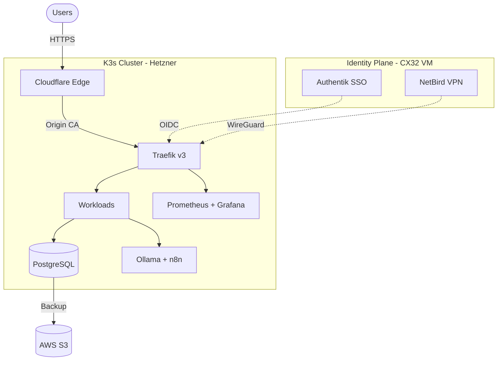

<!-- markdownlint-disable MD033 MD041 -->

  

  

  

  <b>Currently Building:</b> Zero-Trust identity mesh with
  <a href="https://github.com/KeemWilliams/helix-stax-infra">HelixStax</a> —
  self-hosted Authentik + NetBird on K3s.

---

## About

I'm **Wakeem Williams**, a Full-Stack Engineer building everything from frontend to bare metal -- architecture, backend, infrastructure, and AI pipelines. Tech shouldn't feel like a black box. I build self-healing, structurally honest platforms that prioritize transparency over abstraction and ownership over convenience.

---

## Featured Projects

| Project | Description | Stack | Status |
|:--------|:------------|:------|:------:|
| [HelixStax](https://github.com/KeemWilliams/helix-stax-infra) | Full infrastructure platform — GitOps, Zero-Trust identity mesh, monitoring, and AI pipelines on Hetzner bare metal | K3s, Devtron, Authentik, NetBird, Cloudflare | Active |
| [Devtron MCP Server](https://github.com/KeemWilliams/devtron-mcp-server) | Open-source MCP server bridging AI agents to CI/CD pipelines | TypeScript, MCP Protocol | Active |
| [Vacancy Services](https://docs.wakeemwilliams.com/projects/vacancy-services) | Logistics optimization platform | Full-Stack, PostgreSQL | In Progress |

---

## Architecture

---

## Tech Stack

**Infrastructure**: K3s on AlmaLinux 9.7 | Hetzner Cloud | Cloudflare Edge
**Orchestration**: Devtron (GitOps) | Traefik v3 | Flannel CNI
**Identity**: Authentik (OIDC/SAML) | NetBird (Zero-Trust VPN)
**Data**: PostgreSQL | pgvector | Longhorn CSI
**Monitoring**: Prometheus | Grafana | Loki
**AI/Automation**: Ollama | n8n | Open WebUI | SearXNG
**Languages**: Go | Python | TypeScript

<strong>Full stack breakdown with costs and rationale</strong>

See [docs/tech-stack.md](https://github.com/KeemWilliams/KeemWilliams/blob/main/docs/tech-stack.md) for the complete deep-dive including monthly costs, complexity ratings, and tool selection rationale.

[Browse the full technical documentation](https://docs.wakeemwilliams.com)

---

## GitHub Activity

  
  

---

## Roadmap

- [ ] Complete Zero-Trust identity mesh (Authentik + NetBird + Cloudflare)
- [ ] Publish K3s provisioning runbooks as open-source templates
- [ ] Integrate Cloudflare Turnstile bot-protection on public portals
- [ ] Worker node integration for multi-node K3s cluster

---

## Contributing

Interested in infrastructure-as-code, GitOps, or Zero-Trust networking? Check the open issues on [HelixStax](https://github.com/KeemWilliams/helix-stax-infra/issues) or [Devtron MCP Server](https://github.com/KeemWilliams/devtron-mcp-server/issues). PRs and discussions welcome.

---

## Connect

  
  &nbsp;
  
  &nbsp;
  
  &nbsp;
  

  

