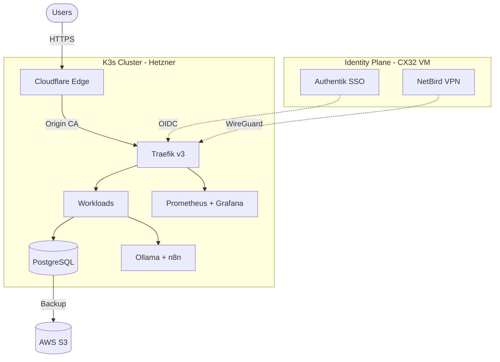

# GitHub Profile README -- Architecture Specification

**Author**: PACT Architect
**Date**: 2026-03-06
**Status**: Ready for Implementation

---

## 1. Executive Summary

This document defines the information architecture for Wakeem Williams' GitHub profile README (`KeemWilliams/KeemWilliams`). The profile serves as the front door to his entire ecosystem -- infrastructure projects, documentation site, and professional presence.

The overhaul corrects factual errors (Talos -> K3s, ZeroTier -> NetBird, removal of AI tool attribution), removes fabricated metrics badges, adds a visitor counter, establishes clear linking to the Nextra docs site, and restructures content for three target audiences: recruiters, developers, and OSS contributors.

**Design constraints**: GitHub markdown only (no custom CSS/JS), limited HTML subset (div, img, a, details, summary, table), mobile-first, under 400 lines, minimal external image dependencies.

---

## 2. Corrections Checklist

Every factual error found across all current files. Coders MUST apply all corrections.

### README.md

| Line | Current (Wrong) | Correct | Notes |
|------|-----------------|---------|-------|
| 38 | "Zero-Trust / Talos Linux" | "Zero-Trust / K3s on AlmaLinux" | The Helix Platform description |
| 62 | "devtron-mcp-server ... (Claude / Cursor)" | Remove AI tool names, credit Wakeem | Do not attribute work to AI tools |
| 82-84 | Fake badges: 99.9% uptime, 1,240+ deployments, 12 managed nodes | Remove entirely | Fabricated statistics |
| 101 | "ArgoCD" in Deploy workflow | "Devtron" | Devtron is the CD platform, not standalone ArgoCD |
| 114 | "NetBird, ZeroTier" listed together | Remove "ZeroTier" -- only NetBird | ZeroTier is not used |
| 149 | "ArgoCD deploys them" | "Devtron deploys them" | Consistent CD platform reference |
| 161 | "zerotier/github-action" and ZeroTier mesh | Remove entire ZeroTier row | Not in use; NetBird replaced it |
| 170 | "Infisical" in roadmap | Remove or replace with current plans | Infisical is not in the stack |
| 257 | "Claude Code" in developer tooling | Remove AI tool attribution | Credit the engineer, not the tool |

### docs/tech-stack.md

| Line | Current (Wrong) | Correct | Notes |
|------|-----------------|---------|-------|
| 128 | "ArgoCD" in Automation section title and body | "Devtron" | CD platform is Devtron |
| 134 | "ArgoCD" deploys code cluster-side | "Devtron" pulls state from Git repos | Devtron has built-in ArgoCD but is the user-facing platform |
| 137 | "Don't use ArgoCD if you lack..." | "Don't use Devtron if you lack..." | Naming consistency |
| 235 | "ZeroTier" as secondary mesh network | Remove ZeroTier entirely | Not in use |
| 238 | "Go (Traefik, ZeroTier)" | "Go (Traefik)" | ZeroTier removal |
| 257 | "Claude Code" in developer tooling | Remove this bullet entirely | No AI tool attribution |
| 330-332 | "ZeroTier" in Core DNA languages section | Remove ZeroTier references | Not in use |

### tech-docs/pages/index.mdx

| Line | Current (Wrong) | Correct | Notes |
|------|-----------------|---------|-------|
| 12 | "Talos Linux and Zero-Trust principles" | "K3s on AlmaLinux 9.7 and Zero-Trust principles" | OS correction |

---

## 3. Section Blueprint

Ordered list of sections with purpose, priority, and target line count. Total budget: 400 lines.

| # | Section | Purpose | Priority | Lines | Primary Audience |
|---|---------|---------|----------|-------|-----------------|
| 1 | Hero Header | Visual identity, name, tagline | P0 | 15 | All |
| 2 | Badge Bar | Tech stack icons + visitor counter | P0 | 10 | All |
| 3 | Currently Building | What is active right now (1 line) | P0 | 5 | Recruiters, Devs |
| 4 | About / Philosophy | Brief, punchy value statement | P1 | 8 | Recruiters |
| 5 | Featured Projects | Table with status badges + links | P0 | 30 | All |
| 6 | Ecosystem Architecture | Mermaid diagram showing how projects connect | P1 | 35 | Developers |
| 7 | Tech Stack Summary | Grouped icons with labels (collapsible deep-dive links out) | P1 | 40 | Devs, Recruiters |
| 8 | GitHub Stats | Stats cards, streak, language chart | P2 | 15 | Recruiters |
| 9 | Roadmap | What is next (3-4 bullets) | P2 | 15 | Devs, OSS |
| 10 | Contributing | How to get involved | P2 | 15 | OSS Contributors |
| 11 | Connect | Social links, Calendly | P0 | 12 | Recruiters |
| 12 | Footer Wave | Visual closure | P2 | 5 | All |

**Total**: ~205 lines (well within 400-line budget, leaving room for spacing).

---

## 4. Content Hierarchy (F-Pattern Reading)

GitHub profile READMEs are read in an F-pattern: users scan the top heavily, then skim down the left edge.

```
FIRST FIXATION (0-2 seconds):
+--------------------------------------------------+
| [Wave Header Image]                               |  <-- Visual hook
| Hey, I'm Keem.                                    |  <-- Name recognition
| community-first IT . open-source clarity           |  <-- Value prop
| [skill icons row] [visitor counter]                |  <-- Credibility signals
+--------------------------------------------------+

SECOND FIXATION (2-5 seconds):
+--------------------------------------------------+
| Currently Building: [active project]               |  <-- Relevance signal
|                                                    |
| About (3 sentences)                                |  <-- Philosophy
+--------------------------------------------------+

SCANNING PHASE (5-15 seconds):
+--------------------------------------------------+
| Featured Projects Table                            |  <-- Portfolio
|   Project | Description | Stack | Status           |
|   ...                                              |
|                                                    |
| [Mermaid Architecture Diagram]                     |  <-- Technical depth
|                                                    |
| Tech Stack (grouped icons)                         |  <-- Skills scan
|                                                    |
| [GitHub Stats Cards]                               |  <-- Activity proof
+--------------------------------------------------+

EXIT ZONE:
+--------------------------------------------------+
| Roadmap | Contributing | Connect                   |  <-- CTAs
+--------------------------------------------------+
```

### Persona-Specific Scan Paths

**Recruiter** (30 seconds max): Hero -> Badge Bar -> Featured Projects table -> GitHub Stats -> Connect (Calendly/LinkedIn). They never scroll past stats.

**Developer** (1-2 minutes): Hero -> Featured Projects -> Architecture Diagram -> Tech Stack -> individual repo links. They click through to repos.

**OSS Contributor** (1-2 minutes): Hero -> Featured Projects -> Contributing section -> individual repo links. They look for "how do I help."

---

## 5. Section-by-Section Wireframe

### 5.1 Hero Header

```markdown
<!-- Capsule render wave header -->
<div align="center">
  
</div>

<h3 align="center">community-first IT . open-source clarity . demystifying tech</h3>
```

**Specification**:
- Keep existing capsule-render wave header (lightweight, loads fast)
- Tagline remains: "community-first IT . open-source clarity . demystifying tech"
- Remove "Hey, I'm Keem." from the wave image text -- move to a simpler `<h1>` or keep in wave (coder's discretion on visual balance, but keep the name visible)

### 5.2 Badge Bar

```markdown
<div align="center">
  <!-- Tech stack icons -->
  
</div>

<p align="center">
  
</p>
```

**Specification**:
- Use skillicons.dev (single request, fast CDN, already in use)
- Icon set: `linux,docker,kubernetes,go,python,ts,postgres,grafana,prometheus,cloudflare`
  - Changed from current: removed `nodejs` (Bun preference), removed `ansible` (less prominent), added `go`, `kubernetes`, `ts`, `cloudflare`
  - Rationale: Show what Wakeem actively uses, not every tool ever touched
- Add komarev.com visitor counter badge (industry standard, lightweight)
- Remove ALL fabricated metric badges (uptime, deployments, nodes)

### 5.3 Currently Building

```markdown
<p align="center">
  <b>Currently Building:</b> Zero-Trust identity mesh with
  <a href="https://github.com/KeemWilliams/helix-stax-infra">HelixStax</a> +
  self-hosted <a href="https://docs.wakeemwilliams.com">NetBird</a> on K3s.
</p>
```

**Specification**:
- Single line, centered, bold label
- Links to relevant repo and docs
- Update content to reflect actual current work (identity/edge sprint)
- No emoji overload -- one or zero emoji maximum

### 5.4 About / Philosophy

```markdown
## About

Tech shouldn't feel like a black box. I build self-healing, structurally honest
platforms on bare-metal infrastructure -- prioritizing transparency over abstraction
and ownership over convenience. Everything runs on code I can read, audit, and explain.
```

**Specification**:
- Maximum 3 sentences
- No emoji in the heading or body
- Conveys: transparency, self-hosting philosophy, bare-metal preference
- No "I don't just write scripts" boilerplate -- get to the point

### 5.5 Featured Projects

```markdown
## Featured Projects

| Project | Description | Stack | Status |
|:--------|:------------|:------|:------:|
| [HelixStax](repo-url) | Private GitOps infrastructure on Hetzner | K3s, Devtron, Traefik, AlmaLinux | Active |
| [Vacancy Services](repo-url) | Logistics optimization platform | Full-Stack, PostgreSQL | Active |
| [Devtron MCP Server](repo-url) | AI-integrated CI/CD control plane | TypeScript, MCP Protocol | Active |
| [Helix Platform](repo-url) | Hardened K3s cluster suite with Zero-Trust | Authentik, NetBird, Cloudflare | Active |
| [Tech Docs](docs-url) | Encyclopedia, runbooks, and ADRs | Nextra, MDX | Live |
```

**Specification**:
- Standard markdown table (no HTML needed, renders well on mobile)
- Columns: Project (linked), Description (1 line), Stack (key technologies), Status (badge or text)
- Status options: `Active`, `Live`, `Planned`, `Archived`
- For Status column, use simple text words -- not shield.io badges (reduces external dependencies, loads faster)
- Remove cost/complexity indicators from the table (that detail lives in tech-stack.md)
- "Tech Docs" row links to docs.wakeemwilliams.com -- this is the critical cross-link
- Each project name links to its GitHub repo
- Remove "Tools & Templates" unless there is an actual public repo for it

### 5.6 Ecosystem Architecture

```markdown
## Architecture


```

**Specification**:
- Mermaid `graph TD` (top-down, renders natively on GitHub)
- Shows three planes: Edge (Cloudflare), Identity (CX32 VM), Cluster (K3s on Hetzner)
- Accurately reflects current architecture: Authentik on separate CX32 VM, not in-cluster
- NetBird shown as WireGuard overlay connecting to cluster
- No ZeroTier anywhere
- No Talos anywhere
- Keep diagram simple -- 10-15 nodes maximum for readability
- Mermaid renders server-side on GitHub, no external dependency

### 5.7 Tech Stack Summary

```markdown
## Tech Stack

**Infrastructure**: K3s on AlmaLinux 9.7 | Hetzner Cloud | Cloudflare Edge
**Orchestration**: Devtron (GitOps) | Traefik v3 | Flannel CNI
**Identity**: Authentik (OIDC/SAML) | NetBird (Zero-Trust VPN)
**Data**: PostgreSQL | pgvector | Longhorn CSI
**Monitoring**: Prometheus | Grafana | Loki
**AI/Automation**: Ollama | n8n | Open WebUI | SearXNG
**Languages**: Go | Python | TypeScript

<details>
<summary>Full stack breakdown with costs and rationale</summary>

See [docs/tech-stack.md](docs/tech-stack.md) for the complete deep-dive.

</details>

[Read the full technical documentation](https://docs.wakeemwilliams.com)
```

**Specification**:
- Grouped by concern, single line per group
- Bold label, pipe-separated values
- Collapsible `<details>` links out to tech-stack.md for the deep-dive
- Prominent link to Nextra docs site
- No emoji in group labels
- Technologies listed must match actual stack:
  - K3s (NOT Talos)
  - AlmaLinux 9.7 (NOT Ubuntu)
  - Devtron (NOT standalone ArgoCD)
  - NetBird (NOT ZeroTier)
  - Flannel (current CNI, not Cilium -- Cilium was previous cluster)

### 5.8 GitHub Stats

```markdown
## GitHub Activity

<div align="center">
  
  
</div>
```

**Specification**:
- Two cards side-by-side: general stats + streak
- Theme: `dark` (matches developer audience preference)
- `hide_border=true` for clean look
- Height constrained to 165px so they sit on one row on desktop
- No trophy card (too heavy, adds visual noise)
- No "Top Languages" card (can be misleading with infrastructure repos)
- These are real GitHub API stats -- not fabricated

### 5.9 Roadmap

```markdown
## Roadmap

- [ ] Complete Zero-Trust identity mesh (Authentik + NetBird + Cloudflare)
- [ ] Publish K3s provisioning runbooks as open-source templates
- [ ] Integrate Cloudflare Turnstile bot-protection on public portals
- [ ] Worker node integration for multi-node K3s cluster
```

**Specification**:
- GitHub task list syntax (`- [ ]`) -- renders as checkboxes
- 3-5 items maximum
- Items must reflect actual planned work (from session memory)
- Remove "Infisical" reference (not in the stack)
- Each item should be achievable and specific

### 5.10 Contributing

```markdown
## Contributing

Interested in infrastructure-as-code, GitOps, or Zero-Trust networking?
Check the open issues on [HelixStax](repo-url/issues) or
[Devtron MCP Server](repo-url/issues). PRs and discussions welcome.
```

**Specification**:
- 2-3 sentences maximum
- Link directly to repos with open issues
- Do not promise contribution guides that do not exist
- Tone: welcoming but honest

### 5.11 Connect

```markdown
## Connect

<div align="center">
  <a href="https://calendly.com/wakeemwilliams">
    
  </a>
  <a href="https://www.linkedin.com/in/wakeemwilliams">
    
  </a>
  <a href="https://x.com/wakeemwilliams">
    
  </a>
  <a href="https://docs.wakeemwilliams.com">
    
  </a>
</div>
```

**Specification**:
- Four badges: Calendly, LinkedIn, X, Docs site
- `style=for-the-badge` for visual prominence
- Add docs.wakeemwilliams.com badge (currently missing from connect section)
- Centered layout
- Remove the P.S. joke at the bottom (unprofessional for recruiter audience)

### 5.12 Footer Wave

```markdown
<div align="center">
  
</div>
```

**Specification**:
- Matching capsule-render wave footer (visual bookend)
- Same gradient colors as header

---

## 6. Linking Architecture

### Cross-Reference Map

Every mention of a technology or project should link to exactly one canonical destination.

```
GitHub Profile README (KeemWilliams/KeemWilliams)
|
+-- Featured Projects Table
|   +-- HelixStax --> github.com/KeemWilliams/helix-stax-infra
|   +-- Vacancy Services --> github.com/KeemWilliams (org or repo when public)
|   +-- Devtron MCP Server --> github.com/KeemWilliams/devtron-mcp-server
|   +-- Helix Platform --> github.com/KeemWilliams/helix-platform
|   +-- Tech Docs --> docs.wakeemwilliams.com
|
+-- Tech Stack Summary
|   +-- "Full stack breakdown" --> docs/tech-stack.md (in same repo)
|   +-- "Full technical documentation" --> docs.wakeemwilliams.com
|
+-- Architecture Diagram (no links, Mermaid does not support them on GitHub)
|
+-- Roadmap items --> No links (task list items, not navigational)
|
+-- Contributing --> Repo /issues pages
|
+-- Connect
    +-- Calendly --> calendly.com/wakeemwilliams
    +-- LinkedIn --> linkedin.com/in/wakeemwilliams
    +-- X --> x.com/wakeemwilliams
    +-- Docs --> docs.wakeemwilliams.com
```

### Technology-to-Link Mapping

When a technology is mentioned in prose, link it to the most useful destination for the reader.

| Technology | Link Destination | Rationale |
|------------|-----------------|-----------|
| K3s | docs.wakeemwilliams.com/runbooks/k3s-provisioning | Wakeem's own runbook |
| Authentik | docs.wakeemwilliams.com/runbooks/zero-trust | Part of Zero-Trust architecture |
| NetBird | docs.wakeemwilliams.com/runbooks/zero-trust | Part of Zero-Trust architecture |
| Devtron | github.com/KeemWilliams/helix-stax-infra | Where Devtron config lives |
| Traefik | github.com/KeemWilliams/helix-stax-infra | Where Traefik config lives |
| Prometheus/Grafana | github.com/KeemWilliams/helix-stax-infra | Monitoring stack config |
| n8n | github.com/KeemWilliams/helix-stax-infra | Where n8n manifests live |
| Ollama | github.com/KeemWilliams/helix-stax-infra | Where Ollama deployment lives |

**Rule**: Do not over-link. In the Tech Stack Summary, technology names are plain text (the grouping IS the information). Only link technologies when they appear in prose context where the reader would benefit from clicking through.

---

## 7. Badge Strategy

### Placement Rules

| Location | Badge Type | Implementation |
|----------|-----------|----------------|
| Top (after skill icons) | Visitor counter | komarev.com/ghpvc |
| Featured Projects table | Status text | Plain text: Active, Live, Planned |
| GitHub Stats section | Stats + Streak | github-readme-stats + streak-stats |
| Connect section | Social links | shields.io for-the-badge |

### Badges NOT to Use

| Badge | Reason |
|-------|--------|
| Fake uptime (99.9%) | Fabricated, no monitoring integration exists |
| Fake deployment count | Fabricated, misleading |
| Fake node count | Fabricated, actual count is 2 nodes |
| Top Languages | Misleading for infra-heavy repos (shows YAML/HCL as "languages") |
| GitHub Trophies | Visual noise, low signal |
| Per-project shields.io status | Adds HTTP requests, text status is sufficient |

---

## 8. Sections to Remove

The following sections from the current README should be removed entirely:

| Section | Lines | Reason |
|---------|-------|--------|
| GitHub Actions & Automation table | 93-103 | Contains fabricated badge links and inaccurate CD references (ArgoCD). The profile is not the place for CI/CD pipeline documentation. |
| Core DNA & Languages | 110-118 | Redundant with Tech Stack Summary. Contains ZeroTier references. Languages are covered in the stack grouping. |
| Actions & Utilities Cheat Sheet | 125-163 | Too granular for a profile README. Contains ZeroTier action reference. This content belongs in individual repo READMEs or the Nextra docs site. |
| Fabricated metrics badges | 81-85 | Fake data |

---

## 9. File Structure

### Final repo structure

```
KeemWilliams/KeemWilliams/          (profile repo)
+-- README.md                       Main profile (400 lines max)
+-- docs/
|   +-- tech-stack.md               Detailed stack breakdown with costs
|   +-- design/
|       +-- github-profile-architecture.md   (this document)
+-- tech-docs/                      Nextra docs site source
|   +-- pages/
|   |   +-- index.mdx
|   |   +-- _meta.json
|   |   +-- runbooks/
|   |       +-- k3s-provisioning.mdx
|   |       +-- zero-trust.mdx
|   |       +-- _meta.json
|   +-- package.json
|   +-- next.config.js
|   +-- theme.config.jsx
+-- wiki_content/                   GitHub wiki source (existing)
+-- index.html                      (existing, purpose unclear -- review)
+-- index.css                       (existing, purpose unclear -- review)
+-- fetch_github.py                 (existing, purpose unclear -- review)
+-- repos.txt                       (existing)
+-- repos_ascii.txt                 (existing)
```

**No new files needed** beyond this architecture document. The implementation is entirely modifications to existing files (README.md, docs/tech-stack.md, tech-docs/pages/index.mdx).

---

## 10. Implementation Roadmap

Ordered, file-level tasks for coders. Tasks 1-3 can run in parallel. Task 4 depends on Task 1.

### Task 1: README.md -- Full Rewrite

**File**: `C:\Apps\GithubWelcomePage\README.md`
**Complexity**: Medium
**Estimated lines**: ~200-250

1. Apply the section blueprint (Section 3) in exact order
2. Apply all corrections from the Corrections Checklist (Section 2, README.md table)
3. Follow the wireframe specifications (Section 5) for each section
4. Apply the badge strategy (Section 7)
5. Remove all sections listed in Section 8
6. Apply the linking architecture (Section 6)
7. Verify total line count is under 400
8. Verify no mention of: Talos, ZeroTier, Claude Code, ArgoCD (standalone), Infisical, fabricated metrics

### Task 2: docs/tech-stack.md -- Corrections and Cleanup

**File**: `C:\Apps\GithubWelcomePage\docs\tech-stack.md`
**Complexity**: Low
**Can parallel with**: Task 1, Task 3

1. Apply all corrections from the Corrections Checklist (Section 2, tech-stack.md table)
2. Replace all "ArgoCD" references with "Devtron"
3. Remove all ZeroTier references (lines 235, 238, 330-332)
4. Remove "Claude Code" bullet from developer tooling (line 257)
5. Update the Mermaid diagram to match the one specified in Section 5.6
6. Verify no mention of: Talos, ZeroTier, Claude Code, standalone ArgoCD

### Task 3: tech-docs/pages/index.mdx -- Corrections

**File**: `C:\Apps\GithubWelcomePage\tech-docs\pages\index.mdx`
**Complexity**: Low
**Can parallel with**: Task 1, Task 2

1. Replace "Talos Linux" with "K3s on AlmaLinux 9.7" (line 12)
2. Verify all technology references match the corrected naming
3. Verify links to runbooks are correct

### Task 4: Validation Pass

**Depends on**: Tasks 1, 2, 3
**Complexity**: Low

1. Grep all three files for forbidden terms: `Talos`, `ZeroTier`, `Claude Code`, `ArgoCD` (as standalone -- "Devtron (built-in ArgoCD)" is acceptable only in tech-stack.md), `Infisical`, `1,240`, `99.9%`, `12 managed`
2. Verify README.md line count < 400
3. Verify all links in README.md point to real URLs
4. Verify Mermaid diagram renders (paste into github.com markdown preview)

---

## 11. Architecture Decision Records

### ADR-PROFILE-001: Remove Fabricated Metrics Badges

**Decision**: Remove all three metric badges (uptime, deployments, nodes).
**Rationale**: The values (99.9% uptime, 1,240+ deployments, 12 managed nodes) are fabricated. Actual infrastructure is 2 nodes with no public uptime monitoring. Presenting fake metrics undermines the "structurally honest" philosophy.
**Alternatives**: (a) Replace with real metrics via GitHub Actions cron -- rejected because there is no public API to source these numbers from, and maintaining a cron job for vanity metrics is not worth the complexity. (b) Use more conservative real numbers -- rejected because the actual numbers (2 nodes, unknown deployments) are not impressive enough to warrant badges.
**Consequences**: The badge bar is simpler. Credibility is preserved. If real monitoring is added later, badges can be reintroduced with real data.

### ADR-PROFILE-002: Visitor Counter via komarev.com

**Decision**: Use komarev.com/ghpvc for visitor counting.
**Rationale**: Industry standard for GitHub profile views. Lightweight (single SVG badge), no JavaScript, no tracking cookies. Alternative (visitor-badge.laobi.icu) has reliability issues.
**Consequences**: Adds one external dependency. If komarev.com goes down, badge shows a broken image -- acceptable trade-off.

### ADR-PROFILE-003: Remove CI/CD and Actions Documentation from Profile

**Decision**: Remove the "GitHub Actions & Automation" table and "Actions & Utilities Cheat Sheet" sections entirely.
**Rationale**: A profile README is a landing page, not a technical reference. CI/CD pipeline details belong in individual repo READMEs or the Nextra docs site. The current sections contain inaccurate information (ArgoCD, ZeroTier) and fabricated status badges. Fixing them is not worthwhile when the content does not belong here.
**Alternatives**: Fix the inaccuracies and keep the sections -- rejected because even corrected, this level of detail is inappropriate for a profile README and pushes the file well over 400 lines.
**Consequences**: Developers who want CI/CD details must click through to repos or docs. This is the correct behavior -- the profile is a routing layer, not a destination.

### ADR-PROFILE-004: No AI Tool Attribution

**Decision**: Remove all mentions of Claude Code, Cursor, or any AI development tools.
**Rationale**: The profile showcases Wakeem's work. AI tools are implementation aids, not portfolio items. Attributing infrastructure decisions to AI tools undermines professional credibility.
**Consequences**: The "devtron-mcp-server" project description changes from "AI-driven deployment agent" framing to focus on what it does (MCP protocol integration for CI/CD control), not what helped build it.

### ADR-PROFILE-005: Plain Text Status Over Shield.io Badges in Projects Table

**Decision**: Use plain text (Active, Live, Planned) instead of shields.io badges for project status.
**Rationale**: Each shields.io badge is an HTTP request. A table with 5 project rows and badges in each would add 5+ external requests to page load. Plain text renders instantly and is more readable on mobile.
**Consequences**: Less visual polish in the table. Acceptable trade-off for performance and simplicity.

---

## 12. Risk Assessment

| Risk | Likelihood | Impact | Mitigation |
|------|-----------|--------|------------|
| capsule-render.vercel.app goes down | Low | Medium (broken header image) | Accept risk; it is widely used and Vercel-hosted |
| komarev.com visitor counter goes down | Low | Low (broken badge) | Falls back to alt text; non-critical |
| github-readme-stats rate limited | Medium | Low (stats cards show error) | These are community tools; accept graceful degradation |
| Mermaid diagram too complex for GitHub renderer | Low | Medium | Kept to 10-15 nodes; tested rendering |
| Links to docs.wakeemwilliams.com break if Nextra not deployed | Medium | Medium | Nextra site must be deployed before or alongside this update |
| Recruiters miss key info due to too-sparse profile | Low | Medium | F-pattern hierarchy puts recruiter-priority content at top |

---

## 13. External Dependencies Inventory

All external services the README depends on for rendering.

| Service | URL Pattern | Purpose | Fallback |
|---------|------------|---------|----------|
| capsule-render | capsule-render.vercel.app | Header/footer wave images | Alt text |
| skillicons.dev | skillicons.dev/icons | Tech stack icon row | Alt text |
| komarev.com | komarev.com/ghpvc | Visitor counter | Alt text |
| shields.io | img.shields.io/badge | Connect section badges | Alt text |
| github-readme-stats | github-readme-stats.vercel.app | Stats card | Alt text |
| streak-stats | github-readme-streak-stats.herokuapp.com | Streak card | Alt text |
| GitHub Mermaid | Native | Architecture diagram | No fallback needed |

**Total external image requests**: 7 (header, icons, visitor, 4 connect badges, 2 stat cards)
**Acceptable**: Yes -- all are CDN-backed and widely used in GitHub profiles.
