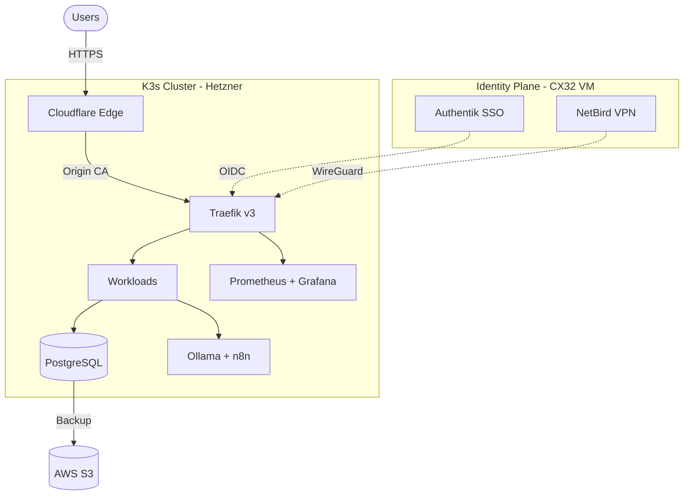

<!-- markdownlint-disable MD033 MD041 -->
# 🏗️ Full Infrastructure & Tech Stack

Welcome to the deep dive on how my systems run. Here, I break down what tools I use, exactly how much they cost, their complexity, and why I selected them.

  
  
  
  

 

  

 

## 🌟 Featured Projects Overview

Before diving into the "How," here are the "What" — the core projects that drive this infrastructure:

- **[Vacancy Services](https://github.com/KeemWilliams)**: Core logistics platform.
- **[HelixStax](https://github.com/KeemWilliams/helix-stax-infra)**: Private GitOps bedrock.
- **[The Helix Platform](https://github.com/KeemWilliams/helix-platform)**: Secure K3s cluster suite.
- **[Tools & Templates](https://github.com/KeemWilliams)**: Reusable CI/CD starter kits.
- **[Devtron MCP Server](https://github.com/KeemWilliams/devtron-mcp-server)**: AI-driven deployment agent.

 

---

 

## 💰 Cloud & Infrastructure Pricing Breakdown

I run my workloads strictly where they provide the most value while keeping monthly burn rates intentionally low. By decoupling away from managed Kubernetes (like EKS/GKE), I maintain full control over performance per dollar.

 

---

 

### **Hetzner Cloud (Core Compute)**

**Cost:** ~$8 - $30 / mo  
**Specs Example:** CPX31 Node (4 vCPU, 8GB RAM, 160GB NVMe SSD) for ~$9.50/mo.

* **Problem:** Big Three cloud providers are prohibitively expensive for baseline compute and bandwidth out.
* **Agitation:** Paying $80/mo just for an empty managed Kubernetes control plane or basic EC2 instances ruins the budget long before a single app is even deployed. It prevents me from experimenting freely.
* **Impact:** It cripples the ability to run multiple testing environments, maintain a zero-trust mesh, or self-host internal developer tools without stressing over a surprise $500 monthly bill.
* **Need:** High-performance, bare-metal-equivalent VMs for under $10. Hetzner gives me the sheer muscular CPU and RAM needed to run a full K3s cluster, Postgres, and AI inference workflows dirt cheap.

 

### **Cloudflare (Edge network)**

**Cost:** $0 / mo (Free Tier)
**Specs:** Global DNS, DDoS Mitigation, Strict WAF.

* **Problem:** Exposing bare-metal or K3s nodes directly to the public internet is a massive security vulnerability.
* **Agitation:** Managing your own DDoS protection, scraping IP rep tables, and automating wildcard SSL certificate renewals across multiple ingress endpoints is an operational nightmare.
* **Impact:** Hours wasted on manual networking triage and bot-stomping instead of building actual platform features.
* **Need:** An enterprise-grade edge network positioned in front of Hetzner. Cloudflare proxies all traffic, terminates SSL instantly, and blocks malicious bots before they ever reach my physical servers.

---

 

### **DigitalOcean (Optional Prototyping)**

**Cost:** ~$10 - $20 / mo
**Specs:** Basic Droplets (1-2 vCPU, 1-2GB RAM) or Managed Postgres DBs.

* **Problem:** Sometimes spinning up a completely fresh, isolated environment inside my existing K3s cluster carries too much "blast radius" risk.
* **Agitation:** I don't want to pollute my Hetzner GitOps bedrock with short-lived, messy API tests or temporary sandbox databases.
* **Impact:** Merging unvetted code or experimental state directly into core infrastructure risks bringing down the main Identity layer or production metrics.
* **Need:** A fast, secondary cloud provider to instantly spin up disposable droplets for rapid prototyping, easily destroyed once the code is proven to work.

---

 

### **AWS & Azure (Edge Integrations)**

**Cost:** ~$2 - $5 / mo (Strictly Pay-as-you-go)
**Specs:** S3 Standard Storage (Gigabytes), Entra ID Free Tier.

* **Problem:** Keeping mission-critical backups (Postgres dumps, Authentic config states) on the exact same physical server as the primary database is a recipe for catastrophic data loss.
* **Agitation:** Setting up specialized off-site storage hardware or configuring complex rsync tunnels to a secondary server is brittle.
* **Impact:** If the Hetzner node dies or the region goes down, everything is gone permanently.
* **Need:** Highly durable off-site block storage. I strictly use AWS S3 exclusively for automated nightly backups—costing pennies—ensuring disaster recovery is completely immune from Hetzner node failures.

 

---

 

## 🛠️ The Core Technology Stack 🥞

 

<b>Orchestration: Kubernetes (K3s) & Docker</b>

 

* **Complexity Rating**: `Advanced` -- Running your own clusters, managing CNIs (Flannel), storage provisions, and ingress maps is notoriously high-friction for newcomers.
 
* **Why this tool?**: I use **K3s** explicitly because it is a lightweight, certified Kubernetes distribution. It removes millions of lines of bloated cloud-provider code, making it perfect for bare-metal, edge, and single-node Hetzner VM deployments. It allows me to build "GitOps everything" infrastructure that self-heals.
 
* **When NOT to use it**: If your application is a simple monolithic CRUD app, putting it in Kubernetes introduces massive overhead. A standard Docker Compose or single VM would be significantly faster to iterate on.
 

 

> [!NOTE]
> 📖 **[Read the K3s Node Provisioning Runbook](https://docs.wakeemwilliams.com/runbooks/k3s-provisioning)** for the exact commands used to build this cluster.

 

<b>Automation & GitOps: GitHub Actions & Devtron</b>

 

* **Complexity Rating**: `Intermediate` -- Workflows and YAML pipelines are relatively easy to read, but strict GitOps patterns take discipline to maintain.
 

* **Why?**: **GitHub Actions** runs my CI tests and lint checks instantly when code is pushed. **Devtron** (which includes ArgoCD internally) handles the deployment cluster-side. Instead of pushing code to production, my production cluster pulls the *state* directly from my Git repos.
 

* **When NOT to use**: Don't use Devtron if you lack containerized build pipelines. It strictly requires manifests/charts.
 

 

<b>Monitoring: Prometheus & Grafana</b>

 

* **Complexity Rating**: `Intermediate` -- Installing is easy (Helm chart); knowing *what* to alert on requires experience so you don't succumb to alert-fatigue.
 

* **Why?**: Absolute, unbridled visibility into disk IO, memory spikes, and container health. If something drops offline in the cluster, my alerts fire immediately.
 

* **When NOT to use**: Don't spin up the entire Prometheus stack just to monitor a single static website.
 

 

<b>Databases: PostgreSQL & SQLite</b>

 

* **Complexity Rating**: `Beginner / Intermediate` -- Very easy to start querying, complex to correctly shard, replicate, and back up securely.
 

* **Why?**: **PostgreSQL** is the world's most robust relational DB. Paired with `pgvector`, it handles both my standard data and AI inference queries. I use **SQLite** religiously for edge-tools (like NetBird configs) where a full DB is overkill.
 

* **When NOT to use**: Don't use standard Postgres for heavy, high-velocity time-series event tracking without extensions.
 

 

<b>AI / Machine Learning & Automation</b>

 

* **Complexity:** `Intermediate` -- Setting up RAG pipelines and self-hosting LLMs requires significant RAM tuning and resource balancing.
 

* **Why?**:
  * **Ollama**: The gold standard for running LLMs locally. It’s fast, simple, and provides a clean API for my other tools.
  * **n8n**: My "central nervous system" for automation. It connects everything from ClickUp to my cluster metrics.
  * **Open WebUI**: Provides a premium, ChatGPT-like experience for interacting with local models.
 

* **Language Notes**: Primarily Python (FastAPI) and TypeScript (Node.js).
 

* **When NOT to use**: Don’t self-host LLMs if you don’t have the spare RAM; it will crawl and eat your compute alive.

 

<b>Identity & Security</b>

 

* **Complexity:** `Advanced` -- Misconfiguring your Identity Provider (IdP) can lock you out of your entire infrastructure.
 

* **Why?**: 
  * **Authentik**: A powerful IdP that handles OIDC, SAML, and provides a unified dashboard for all my apps.
  * **NetBird**: My Zero-Trust Mesh VPN. It allows secure access to internal services without opening ports on the firewall.
  * **External Secrets Operator**: Syncs secrets from external vaults directly into Kubernetes secrets automatically.
 

* **Language Notes**: Go (NetBird), Python (Authentik).
 

* **When NOT to use**: If you only have one user, a full Authentik setup is overkill. Use basic auth instead.
 

> [!NOTE]
> **[See the Zero-Trust Security Architecture](https://docs.wakeemwilliams.com/runbooks/zero-trust)** for details on how I secure external and internal traffic.

 

<b>Networking & Edge</b>

 

* **Complexity:** `Intermediate` -- Requires understanding of TLS termination, wildcard DNS, and ingress routing.
 

* **Why?**:
  * **Traefik**: A modern HTTP reverse proxy and load balancer built for containers with auto-discovery of cluster services.
 

* **Language Notes**: Go (Traefik).
 

* **When NOT to use**: Use Nginx if you need a very simple, static web server without container auto-discovery.

 

<b>Infrastructure & Developer Tooling</b>

 

* **Complexity:** `Intermediate` -- Requires familiarity with CLI tools and the Linux filesystem.
 

* **Why?**:
  * **Ansible**: For idempotent configuration of my base OS (AlmaLinux).
  * **Terraform**: For declaring my cloud resources (Hetzner, AWS) as code.
 

* **Language Notes**: Python (Ansible), Go (Terraform).

 

<b>MCP Servers (AI Agent Integrations)</b>

 

* **Complexity:** `Beginner` -- Mostly configuration based; very high return on investment (ROI).
 

* **Why?**: These allow my AI agents to "speak" to my infrastructure. I can ask my AI to "check cluster health" or "reboot the devtron node" in natural language.
 

* **Connects To**: Terraform, Helm, Kubernetes, Hetzner, GitHub, and more.
 

* **Language Notes**: TypeScript, Python, Go.

 

---

 

## 🗺️ Infrastructure & Ecosystem Architecture

Here is a live look at how my core traffic routing, identity provisioning, and clusters communicate securely:

 

---

 

## 💻 Core DNA & Languages

The choice of language determines the durability and performance of a system. I focus on high-efficiency, type-safe, and scalable foundations:

- **Go (Golang):** My primary choice for high-concurrency tooling like NetBird and custom Kubernetes controllers. I leverage Go's performance and static typing to build resilient infrastructure components.
- **Python:** Powering the AI workflows (Ollama/FastAPI) and the central automation brain (Ansible/n8n). Python's ecosystem allows for rapid prototyping and integration of complex logic.
- **TypeScript / Node.js:** Used for modern, fast, and interactive MCP servers and frontend dashboards. It provides the type safety needed for large-scale application logic.
- **Rust:** (Exploring) For next-gen edge processing where every microsecond and byte matters.

 

[← Back to the main README](../README.md)
