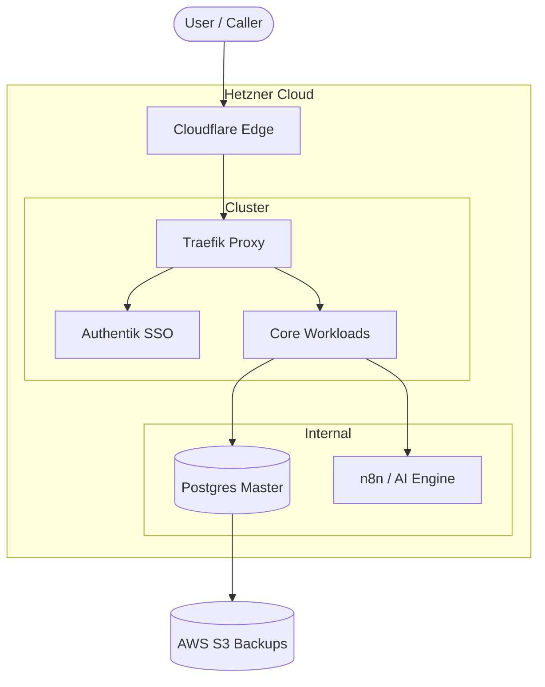

# 🏗️ Full Infrastructure & Tech Stack

Welcome to the deep dive on how my systems run. This documentation site provides the "Executive Summary" of my infrastructure, including projects, costs, rationales, and architectural blueprints.

## 🌟 Featured Projects

Before exploring the underlying infrastructure, here are the primary systems active in this ecosystem:

- **Vacancy Services**: My core platform optimizing logistics and supply chain visibility.
- **HelixStax**: A private, immutable GitOps bedrock for all internal services.
- **The Helix Platform**: A hardened K3s cluster suite on AlmaLinux 9.7 with Zero-Trust principles.
- **Tools & Templates**: Reusable starter kits for rapid, standardized environment provisioning.
- **Devtron MCP Server**: An AI-integrated CI/CD agent for autonomous deployment management.

---

## 💰 Cloud & Infrastructure Pricing

I run my workloads strictly where they provide the most value 💎 while keeping monthly burn rates 💸 intentionally low.

### Hetzner Cloud 🔴 (The Core Compute)

**Cost:** ~$8 - $30 / mo  
**Specs:** CPX31 Node (4 vCPU, 8GB RAM, 160GB NVMe SSD) for ~$9.50/mo.

> [!IMPORTANT]
> **The Problem:** Big Three providers (AWS, Azure, GCP) are prohibitively expensive for baseline compute and bandwidth out.
> **The Solution:** Hetzner provides the raw muscular CPU/RAM needed for K3s and AI inference at a fraction of the cost.

### Cloudflare 🟠 (The Edge Network)

**Cost:** $0 / mo (Free Tier)  
**Specs:** Global DNS, DDoS Mitigation, Strict WAF.

> [!TIP]
> **The Solution:** Cloudflare terminates SSL instantly and blocks malicious bots before they ever reach my physical servers.

---

## 🛠️ The Core Technology Stack

### Orchestration: Kubernetes (K3s) & Docker

- **Complexity:** 🏔️ Advanced
- **Why?** Lightweight, certified K8s distribution that removes cloud-provider bloat. Perfect for bare-metal and edge deployments.
- **When NOT to use:** If your app is a simple monolith, standard Docker Compose is faster to iterate on.

> [!NOTE]
> 📖 **[Read the K3s Node Provisioning Runbook](./runbooks/k3s-provisioning)** for the exact commands used to build this cluster.

### AI / Machine Learning & Automation

- **Complexity:** 🧗 Intermediate
- **Tools:** Ollama, n8n, Open WebUI.
- **Why?** Self-hosting allows for privacy and performance tuning without paying per-token API fees.

### Identity & Security

- **Complexity:** 🏔️ Advanced
- **Tools:** Authentik, NetBird, External Secrets.
- **Why?** Zero-Trust ensures that if you're not on the private mesh, the infrastructure "does not exist" to you.

> [!NOTE]
> 🔒 **[See the Zero-Trust Security Policy](./runbooks/zero-trust)** for details on how I secure traffic.

---

## 🗺️ Architecture Blueprint

---

## 💻 Core DNA & Languages

I focus on high-efficiency, type-safe, and scalable foundations to ensure long-term system durability.

- **Go (Golang):** High-concurrency tooling and Kubernetes controllers.
- **Python:** AI workflows and automation logic.
- **TypeScript:** Fast, interactive dashboards and MCP servers.
- **Rust:** Extreme performance for edge processing.

[← Back to the main README](https://github.com/KeemWilliams)
